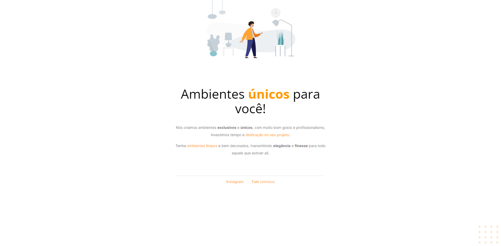

# Explorer Projeto 01
 Primeiro projeto do explorer é a criação de uma página de móveis customizados.

## Aprendizados
Devido ser o primeiro projeto e além de já ter uma boa base de html e css, foi um projeto bem tranquilo de ser concluído, e espero continuar nessa crescente nos projetos seguintes.

## Stack utilizada

- Html;
- Css

## 🔗 Links
